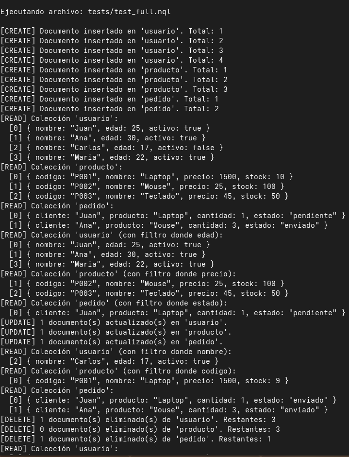
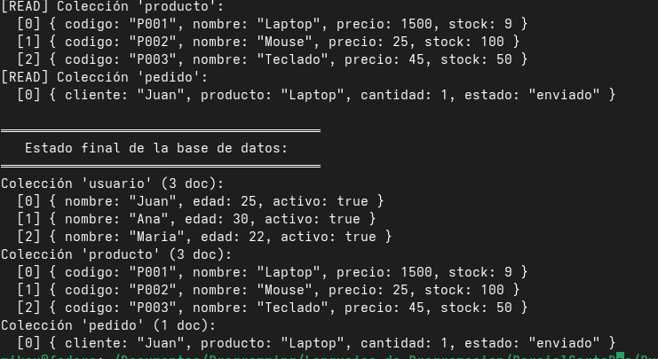
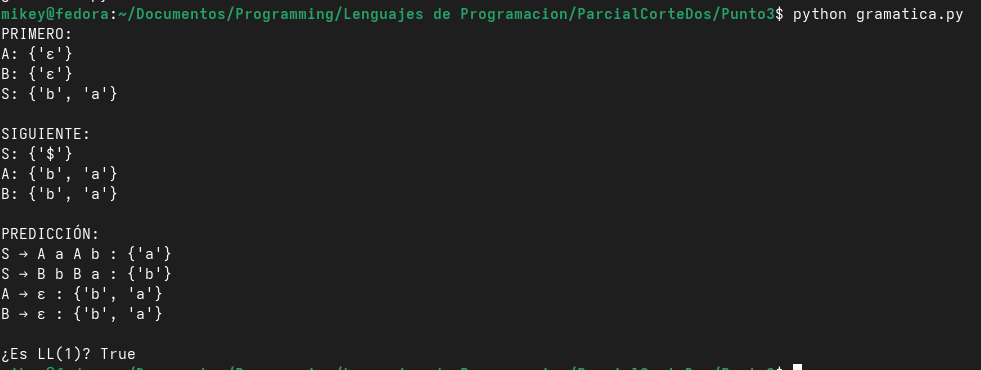
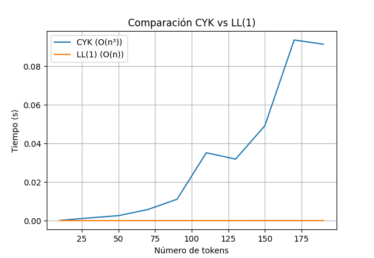
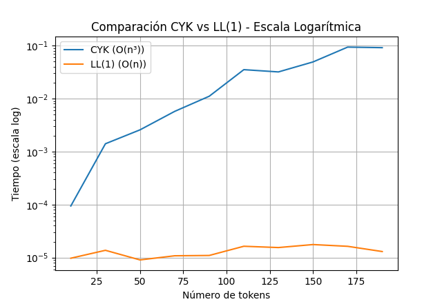
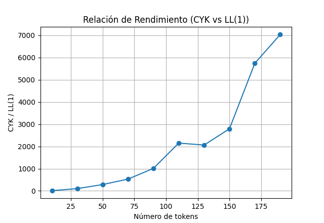
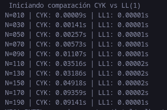
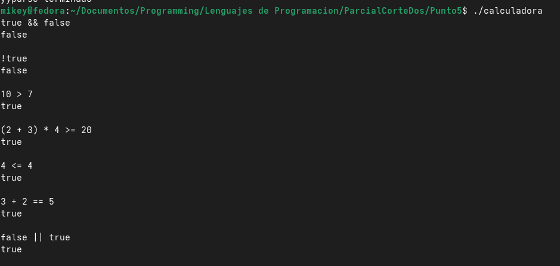

**Estudiante:** Miguel Ángel Celis López  
**Profesor:** Joaquín Fernando Sánchez  
**Asignatura:** Lenguajes de Computación  
**Ciudad:** Bogotá  
**Año:** 2026


# Introducción:

El presente trabajo corresponde al segundo parcial de la asignatura Lenguajes de Programación, en el cual se abordan distintos conceptos fundamentales del diseño e implementación de lenguajes formales y analizadores sintácticos.

El proyecto integra múltiples componentes que permiten comprender cómo se construyen lenguajes de programación, cómo se procesan sus estructuras y cómo varía el rendimiento de los analizadores dependiendo del enfoque utilizado. Además, se desarrollan aplicaciones prácticas como un lenguaje de consultas tipo CRUD y una calculadora booleana, reforzando la relación entre teoría y práctica en el área de compiladores.

# Objetivo General:

Diseñar, implementar y analizar diferentes gramáticas y algoritmos de análisis sintáctico, evaluando su comportamiento y rendimiento mediante el desarrollo de aplicaciones prácticas como un lenguaje CRUD para bases de datos no relacionales y una calculadora booleana.

# Objetivos Específicos:

• Diseñar una gramática formal para un lenguaje de consultas CRUD orientado a bases de datos no relacionales.

• Implementar dicha gramática utilizando herramientas de generación de analizadores sintácticos como Bison y ANTLR, validando su correcto funcionamiento mediante pruebas.

• Analizar formalmente una gramática dada, calculando los conjuntos PRIMERO, SIGUIENTE y PREDICCIÓN, con el fin de demostrar que cumple la propiedad LL(1).

• Implementar un parser basado en el algoritmo CYK y compararlo con un parser predictivo LL(1), evaluando su rendimiento mediante pruebas experimentales y gráficas.

• Desarrollar una calculadora de escritorio utilizando YACC (Bison) y Flex, capaz de evaluar expresiones booleanas, analizando el desempeño del analizador sintáctico generado.

• Comparar diferentes enfoques de parsing (LL(1), LALR(1) y CYK), identificando sus ventajas, desventajas y aplicabilidad en el diseño de lenguajes.

# Punto 1 y 2:


# NQL — NoSQL Query Language

Lenguaje de consulta CRUD para bases de datos no relacionales en memoria, implementado en **Flex + Bison** y definido formalmente en **ANTLR4**.

---

## Estructura del Proyecto

```
ParcialCorteDos/
├── NQL.l           ← Analizador léxico (Flex)
├── NQL.y           ← Analizador sintáctico + intérprete (Bison)
├── NQL.g4          ← Gramática formal (ANTLR4)
├── nql_types.h     ← Tipos de datos compartidos (C header)
├── Makefile        ← Automatización de compilación y pruebas
├── tests/
│   ├── test_create.nql   → Pruebas CREATE
│   ├── test_read.nql     → Pruebas READ (con filtros)
│   ├── test_update.nql   → Pruebas UPDATE
│   ├── test_delete.nql   → Pruebas DELETE
│   └── test_full.nql     → Prueba integral CRUD (múltiples colecciones)
└── README.md
```

---

## Compilar y Ejecutar

```bash
# Compilar (requiere: bison, flex, gcc)
make

# Ejecutar en modo interactivo
./nql

# Ejecutar un archivo .nql
./nql tests/test_full.nql

# Ejecutar todas las pruebas
make test
```

---

## Sintaxis del Lenguaje

### CREATE — `nuevo`

```
nuevo <colección> { <clave>: <valor>, ... }
```

```
nuevo usuario { nombre: "Juan", edad: 25, activo: true }
nuevo producto { codigo: "P001", precio: 1500.99, stock: 10 }
```

### READ — `buscar`

```
buscar <colección>
buscar <colección> donde <clave> <operador> <valor>
```

```
buscar usuario
buscar usuario donde edad < 20
buscar usuario donde nombre = "Ana"
buscar usuario donde activo = false
```

### UPDATE — `actualizar`

```
actualizar <colección> asignar <clave> = <valor>
actualizar <colección> asignar <clave> = <valor> donde <clave> <op> <valor>
```

```
actualizar usuario asignar activo = true donde nombre = "Carlos"
actualizar usuario asignar pais = "Colombia"
```

### DELETE — `eliminar`

```
eliminar <colección>
eliminar <colección> donde <clave> <operador> <valor>
```

```
eliminar usuario donde edad < 18
eliminar pedido donde cliente = "Ana"
eliminar usuario   # elimina todos
```

---

## Tipos de Datos

| Tipo     | Ejemplo              |
| -------- | -------------------- |
| Número   | `25`, `1500.99`, `0` |
| Cadena   | `"Juan"`, `"P001"`   |
| Booleano | `true`, `false`      |
| Nulo     | `null`               |

---

## Operadores de Comparación

| Operador | Significado   |
| -------- | ------------- |
| `=`      | Igual a       |
| `!=`     | Distinto de   |
| `>`      | Mayor que     |
| `<`      | Menor que     |
| `>=`     | Mayor o igual |
| `<=`     | Menor o igual |

---

## Límites de la Base de Datos en Memoria

- Máximo **10 colecciones** activas simultáneamente
- Documentos ilimitados por colección
- Los datos **solo persisten durante la ejecución** del programa

---

## Resultados de Pruebas

### Test CREATE (`tests/test_create.nql`)

```
[CREATE] Documento insertado en 'usuario'. Total: 1
[CREATE] Documento insertado en 'usuario'. Total: 2
[CREATE] Documento insertado en 'usuario'. Total: 3
[CREATE] Documento insertado en 'usuario'. Total: 4
[CREATE] Documento insertado en 'producto'. Total: 1
[CREATE] Documento insertado en 'producto'. Total: 2
[READ] Colección 'usuario':
  [0] { nombre: "Juan", edad: 25, activo: true }
  [1] { nombre: "Ana", edad: 30, activo: true }
  [2] { nombre: "Carlos", edad: 17, activo: false }
  [3] { nombre: "Maria", edad: 22, activo: true }
[READ] Colección 'producto':
  [0] { nombre: "Laptop", precio: 1500.99, stock: 10 }
  [1] { nombre: "Mouse", precio: 25.5, stock: 100 }
```

### Test READ (`tests/test_read.nql`) — con filtros WHERE

```
[READ] Colección 'usuario' (con filtro donde nombre):
  [1] { nombre: "Ana", edad: 30, activo: true }
[READ] Colección 'usuario' (con filtro donde edad):
  [2] { nombre: "Carlos", edad: 17, activo: false }
[READ] Colección 'usuario' (con filtro donde edad):
  [1] { nombre: "Ana", edad: 30, activo: true }
  [4] { nombre: "Pedro", edad: 35, activo: false }
[READ] Colección 'usuario' (con filtro donde activo):
  [2] { nombre: "Carlos", edad: 17, activo: false }
  [4] { nombre: "Pedro", edad: 35, activo: false }
```

### Test UPDATE (`tests/test_update.nql`)

```
[UPDATE] 1 documento(s) actualizado(s) en 'usuario'.   ← filtrado por nombre
[UPDATE] 3 documento(s) actualizado(s) en 'usuario'.   ← sin filtro (todos)
[UPDATE] 1 documento(s) actualizado(s) en 'usuario'.   ← campo nuevo 'pais'
```

### Test DELETE (`tests/test_delete.nql`)

```
[DELETE] 2 documento(s) eliminado(s) de 'usuario'. Restantes: 3  ← edad < 18
[DELETE] 1 documento(s) eliminado(s) de 'usuario'. Restantes: 2  ← nombre = "Pedro"
[DELETE] 2 documento(s) eliminado(s) de 'usuario'. Restantes: 0  ← sin filtro (todos)
```

### Test FULL CRUD — 3 colecciones (`tests/test_full.nql`)

Demostración de las 4 operaciones sobre las colecciones `usuario`, `producto` y `pedido` simultáneamente. 

---

## Gramática BNF

```bnf
<programa>       ::= <sentencia> | <sentencia> <programa>

<sentencia>      ::= <create_op> | <read_op> | <update_op> | <delete_op>

<create_op>      ::= "nuevo" <id> "{" <pares> "}"

<read_op>        ::= "buscar" <id>
                   | "buscar" <id> "donde" <condicion>

<update_op>      ::= "actualizar" <id> "asignar" <asignacion>
                   | "actualizar" <id> "asignar" <asignacion> "donde" <condicion>

<delete_op>      ::= "eliminar" <id>
                   | "eliminar" <id> "donde" <condicion>

<pares>          ::= <par> | <par> "," <pares>
<par>            ::= <id> ":" <valor>

<asignacion>     ::= <id> "=" <valor>

<condicion>      ::= <id> <operador> <valor>

<operador>       ::= "=" | "!=" | ">" | "<" | ">=" | "<="

<valor>          ::= <numero> | <cadena> | <booleano> | <nulo>
<booleano>       ::= "true" | "false"
<nulo>           ::= "null"
```

---

## ANTLR4

El archivo `NQL.g4` contiene la gramática formal compatible con ANTLR4 v4.x.

```bash
# Instalar ANTLR4 tools (requiere Python 3)
pip install antlr4-tools

# Generar parser en Python3
antlr4 -Dlanguage=Python3 NQL.g4 -o antlr_gen

# O usando el JAR directamente
java -jar antlr-4.13.1-complete.jar NQL.g4 -o antlr_gen

# También disponible como target Make
make antlr
```

---

## Comentarios en NQL

Se pueden escribir comentarios de línea con `#`:

```
# Este es un comentario
nuevo usuario { nombre: "Test" }   # comentario al final de línea
```




# Punto 3;
## Jerarquía de carpetas:
```
ParcialCorteDos/Punto3
├── gramatica.py           ← Programa principal
```

## Gramática LL(1)

**Se analiza la siguiente gramática:**

```
S → AaAb | BbBa
A → ε
B → ε
```

## Como calcular PRIMERO(X):

El conjunto PRIMERO(X) contiene los símbolos terminales que pueden aparecer al inicio de alguna cadena derivada de X.

Procedimiento

Para A:

```
* A → ε
⇒ PRIMERO(A) = { ε }
```

Para B:

```
* B → ε
⇒ PRIMERO(B) = { ε }
```

Para S:

Producción 1:

```
S → AaAb
A → ε ⇒ se elimina
```

Queda: a A b

```
* A → ε ⇒ se elimina
⇒ inicia con 'a'

Producción 2:
S → BbBa
B → ε ⇒ se elimina
Queda: b B a
```

```
* B → ε ⇒ se elimina
⇒ inicia con 'b'
```

**Resultado:**

```
PRIMERO(S) = { a, b }
PRIMERO(A) = { ε }
PRIMERO(B) = { ε }
```

## Calculo de Siguiente(X)

El conjunto SIGUIENTE(X) contiene los símbolos que pueden aparecer inmediatamente después de X en alguna derivación.

Procedimiento
Para S:

```
S es símbolo inicial
⇒ SIGUIENTE(S) = { $ }
```

Para A:

Producción:

```
S → A a A b
Primer A → seguido de 'a'
Segundo A → seguido de 'b'
⇒ SIGUIENTE(A) = { a, b }
```

Para B:

Producción:

```
* S → B b B a
Primer B → seguido de 'b'
Segundo B → seguido de 'a'
⇒ SIGUIENTE(B) = { a, b }
```

**Resultado:**

```
SIGUIENTE(S) = { $ }
SIGUIENTE(A) = { a, b }
SIGUIENTE(B) = { a, b }

```

## Calculo de Predicción(X)

El conjunto de PREDICCIÓN permite determinar qué producción usar con base en el símbolo de entrada.

Procedimiento

Para S:

```
S → AaAb
PRIMERO(AaAb) = { a }
⇒ PRED = { a }
S → BbBa

PRIMERO(BbBa) = { b }
⇒ PRED = { b }
Para A:
A → ε
⇒ PRED(A → ε) = SIGUIENTE(A) = { a, b }
Para B:
B → ε
⇒ PRED(B → ε) = SIGUIENTE(B) = { a, b }
```

**Resultado**

```
S → AaAb = { a }
S → BbBa = { b }
A → ε = { a, b }
B → ε = { a, b }
```

## Derivación de la Gramática

- ```Cadena: "ab"
  S
  ```

⇒ AaAb
⇒ ε a A b
⇒ a A b
⇒ a ε b
⇒ ab

````

* ```Cadena: "ba"
S
⇒ BbBa
⇒ ε b B a
⇒ b B a
⇒ b ε a
⇒ ba

````

**Lenguaje generado**

```
L = { ab, ba }
```

## ¿La gramática es LL(1)?

Una gramática es LL(1) si los conjuntos de predicción de sus producciones no se intersectan.

## Verificación:

PRED(S → AaAb) = { a } PRED(S → BbBa) = { b } ⇒ { a } ∩ { b } = ∅ ✔

La gramática **SÍ** es LL(1), dado a que no existen conflictos con los conjuntos de predicción y se puede decidir la produccion correcta con un solo simbolo.

Por lo tanto, esta gramática si cumple con ser LL(1) y permite un análisis sintáctico deterministico.

## Pasos de Ejecución:

Dentro de la terminal, ejecutar el siguiente comando desde la carpeta base

```bash
python3 gramatica.py
```

## Ejecución del Código 3



# Punto 4
## Jerarquia de carpetas:

```
Punto4/
│
├── comparador.py        # Script principal (benchmark y ejecución)
├── cyk.py               # Implementación del algoritmo CYK
├── ll1.py               # Parser predictivo LL(1)
├── graficas.py          # Generación de gráficas
├── gramatica_cyk.txt    # Gramática en CNF usada por CYK
├── out.txt              # Resultados de ejecución (opcional)
```

Implementación de un Parser utilizando el algoritmo CYK para realizar operaciones de una calculadora, para compararlas con un parser de tipo predictivo para comparar su rendimiento.

## Algoritmo CYK

El algoritmo CYK (Cocke-Younger-Kasami) es un método de análisis sintáctico que requiere que la gramática esté en Forma Normal de Chomsky (CNF).

En este punto se implementó dentro de `cyk.py`
Utiliza una tabla triangular para evaluar combinaciones de símbolos
Evalúa si una cadena pertenece al lenguaje definido por la gramática

## Gramática utilizada

```
S -> X Y
S -> Y X
X -> a
Y -> b
```

Sin embargo, este puede ser cambiado por distintas gramáticas desde el .txt llamado "gramatica_cyk.txt"

## Parser LL(1)

Se implementó un parser predictivo LL(1) en `ll1.py` .

## Resultado Esperado:

```

N=010 | CYK: 0.00013s | LL1: 0.00001s
N=050 | CYK: 0.00691s | LL1: 0.00000s
N=100 | CYK: ~0.08s   | LL1: ~0.00001s
N=190 | CYK: 0.28982s | LL1: 0.00001s

(Archivo: out.txt )

```

## Gráficas Generadas

Las gráficas se generan en `graficas.py` .

### 1. Tiempo vs Tokens

Muestra el crecimiento del tiempo de ejecución:

```
CYK crece rápidamente
LL(1) se mantiene prácticamente constante
```



### 2. Escala logarítmica

Permite visualizar mejor la diferencia de crecimiento:

```
CYK presenta comportamiento cúbico
LL(1) se mantiene cercano a lineal
```



### 3. Relación de rendimiento (CYK / LL1)

Muestra cuántas veces CYK es más lento que LL(1):

```
La diferencia aumenta con el tamaño de la entrada
CYK se vuelve significativamente menos eficiente
```



### 4. Complejidad

```
CYK   → O(n³)
LL(1) → O(n)
```

## Pasos de Ejecución

```bash
python3 comparador.py
```

## Ejecución del Código 4



## Conclusiones:

El parser LL(1) presenta un desempeño significativamente superior al algoritmo CYK, debido a su complejidad lineal frente al crecimiento cúbico de CYK. Los resultados y las gráficas obtenidas confirman que CYK es menos eficiente para este tipo de gramáticas determinísticas.

# Punto 5:

## Jerarquia de Carpetas:
```
├── Punto5/
│   ├──                         # Código fuente
│   │   ├── calculadora_de_escritorio.y
│   │   ├── lexer_calculadora.l
│   │   └── pruebas.txt
│   │
│   ├──                    # Archivos generados
│   │   ├── calculadora_de_escritorio.tab.c
│   │   ├── calculadora_de_escritorio.tab.h
│   │   ├── lex.yy.c
│   │   └── calculadora              # ejecutable
│   │
│   ├── 
│   │   └── out.log
│   │
│   └── 
│       └── test_lex.c
│
```

Calculadora de Escritorio:

## Descripción

Se implementó una calculadora de escritorio utilizando YACC (Bison) y Flex, capaz de evaluar expresiones booleanas, comparaciones y operaciones aritméticas.

## Características del Lenguaje

La calculadora soporta:

🔹 Expresiones booleanas

```
true && false
true || false
!true
```

🔹 Comparaciones

```
3 + 2 == 5
10 > 7
4 <= 4
```

🔹 Expresiones aritméticas

```
(2 + 3) * 4 >= 20
```

## Analizador Léxico (Flex)

**Archivo:** `lexer_calculadora.l`

Se encarga de:

Reconocer tokens como:

```true, false
&&, ||, !
+, -, *, /
==, !=, <, >, <=, >=
números
paréntesis
```

### Analizador Sintáctico (Bison)

**Archivo:** `calculadora_de_escritorio.y`

Se encarga de:

- Definir la gramática
- Evaluar expresiones
- Aplicar precedencia de operadores

Esta entrega también incluye la **Calculadora Booleana de Escritorio** (`Punto5/`), desarrollada interactuando no con línea de comandos paso a paso sino analizando directamente un archivo `.txt` (`pruebas.txt`), demostrando manejo de I/O sobre Flex y Bison sin modo interactivo.

### Uso y Salida

La calculadora lee sentencias línea a línea desde `pruebas.txt`. Por cada expresión, el programa imprime la expresión evaluada, y posteriormente el resultado en formato Booleano (`true` o `false`):

```
true && false
false

!true
false

(2 + 3) * 4 >= 20
true

4 <= 4
true
```

### Análisis de Rendimiento y Desempeño del Analizador Sintáctico

La utilización de **Bison** permite generar un parser del tipo **LALR(1)** el cual presenta las siguientes características:

1. **Parser Determinista (Shift-Reduce):**
   El analizador sintáctico opera mediante un mecanismo de desplazamiento y reducción (shift-reduce), utilizando una pila y una tabla de análisis generada en tiempo de compilación.
   Esto permite tomar decisiones determinísticas con un solo token de anticipación, sin necesidad de backtracking.

2. **Complejidad de Ejecución:**
   La complejidad del parser es **O(n)**, donde _n_ es el número de tokens de entrada, ya que cada token es procesado una única vez durante el análisis sintáctico.

3. **Eficiencia en el Procesamiento:**
   - Las tablas del parser se generan en compilación
   - En ejecución solo se realizan consultas a dichas tablas
   - La evaluación semántica ocurre de manera inmediata

4. **Interacción con Flex:**
   Flex realiza la tokenización utilizando buffers eficientes en C, lo que reduce el costo de lectura desde archivo y permite un flujo continuo de tokens hacia el parser.

## Ejecución del Programa:

1.  Generar el parser

```bash
bison -d calculadora_de_escritorio.y
```

2. Generar el lexer

```bash
flex lexer_calculadora.l
```

3. Compilar

```bash
gcc lex.yy.c calculadora_de_escritorio.tab.c -o calculadora -lm
```

4. Ejecutar

```bash
./calculadora
```

## Ejecución del Código 5



## Conclusión del Ejercicio:

La calculadora implementada demuestra ser eficiente, con complejidad lineal O(n), capaz de evaluar expresiones booleanas en tiempo real. Gracias a la generación de tablas de parsing en tiempo de compilación, el análisis en ejecución es rápido, determinístico y sin retrocesos, lo que la hace adecuada para aplicaciones como intérpretes y compiladores.
